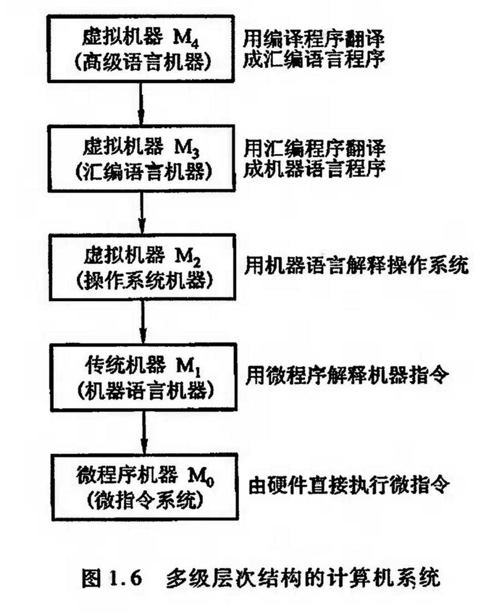
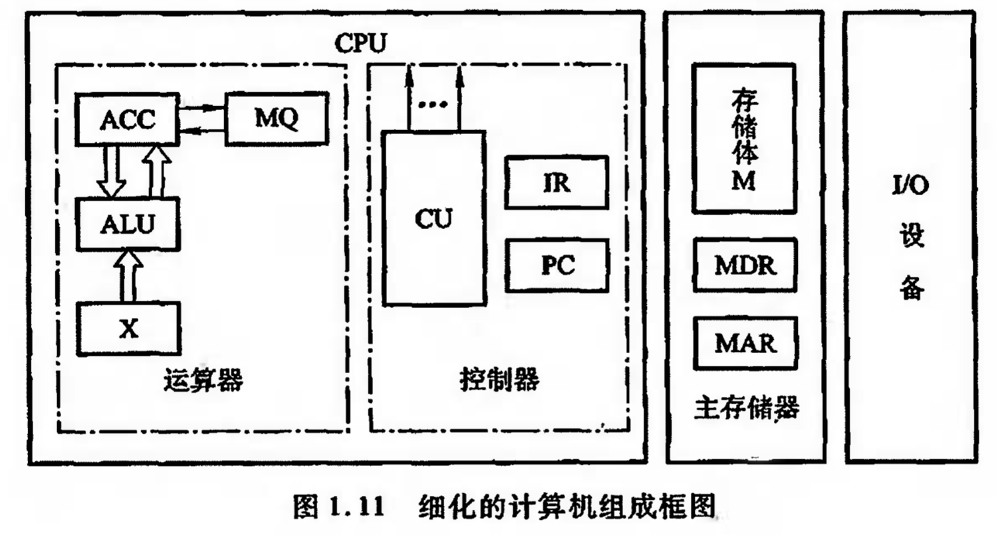
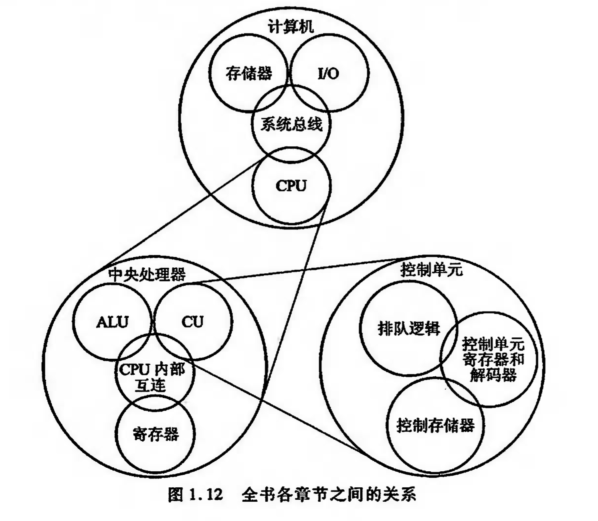

# 计算机组成原理 - 唐朔飞

## 目录

Ⅰ 概论

一、计算机系统概论

二、计算机的发展及应用

Ⅱ 计算机系统的硬件结构

三、系统总线

四、存储器

五、输入输出系统

Ⅲ 中央处理器

六、计算机的运算方法

七、指令系统

八、CPU的结构和功能

Ⅳ 控制单元

九、控制单元的功能

十、控制单元的设计

## Ⅰ 概论

### 一、计算机系统概论

1. 计算机系统由硬件和软件两大部分组成。

2. 软件分为系统软件与应用软件。系统软件也称为系统程序，包括标准程序库、语言处理程序、操作系统、服务程序、数据库管理系统、网络软件等。

3. 具有多层次结构的计算机系统

4. 在学习计算机组成时，应当注意如何区别计算机体系结构与计算机组成这两个基本概念。
   1. 计算机体系结构是指那些能够被程序员所见到的计算机系统的属性，即概念性的结构与功能特性。计算机系统的属性通常是指用机器语言编程的程序员（也包括汇编语言程序设计者和汇编程序设计者）所看到的传统机器的属性，包括指令集、数据类型、存储器寻址技术、VO机理等，大都属于抽象的属性。由于计算机系统具有多级层次结构，因此，站在不同层次上编程的程序员所看到的计算机属性也是各不相同的。例如，用高级语言编程的程序员可以把IBMPC与RS6000两种机器看成是同一属性的机器。可是，对使用汇编语言编程的程序员来说，IBMPC与RS6000是两种截然不同的机器。因为程序员所看到的这两种机器的属性，如指令集、数据类型、寻址技术等，都完全不同，因此，认为这两种机器的结构是各不相同的。
   2. 计算机组成是指如何实现计算机体系结构所体现的属性，它包含了许多对程序员来说是透明的硬件细节。例如，指令系统体现了机器的属性，这是属于计算机结构的问题。但指令的实现，即如何取指令、分析指令、取操作数、运算、送结果等，这些都属于计算机组成问题。因此，当两台机器指令系统相同时，只能认为它们具有相同的结构。至于这两台机器如何实现其指令的功能，完全可以不同，则它们的组成方式是不同的。例如，一台机器是否具备乘法指令的功能，这是一个结构问题，可是，实现乘法指令采用什么方式，则是一个组成问题。实现乘法指令可以采用一个专门的乘法电路，也可以采用连续相加的加法电路来实现，这两者的区别就是计算机组成的区别。究竟应该采用哪种方式来组成计算机，要考虑到各种因素，如乘法指令使用的频度、两种方法的运行速度、两种电路的体积、价格、可靠性等。
   3. 不论是过去还是现在，区分计算机结构与计算机组成这两个概念都是十分重要的。例如，许多计算机制造商向用户提供一系列体系结构相同的计算机，而它们的组成却有相当大的差别，即使是同一系列不同型号的机器，其价格和性能也是有极大差异的。因此，只知其结构，不知其组成，就选不好性能价格比最合的机器。此外，一种机器的体系结构可能维持许多年，但机器的组成却会随着计算机技术的发展而不断变化。例如、1970年首次推出了IBMSystem/370结构，它包含了许多机型。一般需求的用户可以买价格便宜的低速机型；对需求高的用户，可以买一台升级的价格稍贵的机型，而不必抛弃原来已开发的软件。许多年来，不断推出性能更高、价格更低的机型，新机型总归保留着原来机器的结构，使用户的软件投资不致浪费。本书主要研究计算机的组成，有关计算机体系结构的内容将在“计算机体系结构”课程中讲述。

5. 冯·诺依曼结构计算机的特点
   1. 计算机有运算器、存储器、控制器、输入设备和输出设备五大部件组成。
   2. 指令和数据以同等地位存放于存储器内。并可按地址访问。
   3. 指令和数据均可用二进制表示。
   4. 指令由操作码和地址吗组成。操作码表示操作的性质、地址码表示操作数在存储器中的位置。
   5. 指令在存储器中按顺序存放。通常，指令时顺序执行的。在特殊情况下，可根据运算结果或指定的条件来改变运算顺序。
   6. 机器以运算器为中心。输入输出设备和存储器之间的数据传送通过运算器完成。

6. 计算机的五大部件（中央处理器、I/O、主存储器）

   1. 运算器，用来完成算术运算和逻辑运算，并将运算的中间结果暂存在运算器内。

   2. 控制器，用来控制、指挥程序和数据的输入、运行以及处理运算结果。

   3. 存储器，用来存放数据和程序。

   4. 输入设备，用来将人们熟悉的信息形式转换为机器能识别的信息形式，常见的有键盘、鼠

      标等。

   5. 输出设备，可将机器运算结果转换为人们熟悉的信息形式，如打印机输出、显示器输出等。

7. 计算机组成框图

   1. 【主存储器】存储体，存储数据寄存器（Memory Data Register），存储地址寄存器（Memory Address Register）
   2. 存储体-存储单元-存储元，存储字、存储字长，存储单元地址号
   3. 按地址存取方式，指按存储单元地址号来实现对存储字各位的存（写入）、取（读取）。
   4. 早期计算机的存储字长一般和机器的指令字长、数据字长相等，故访问一次主存便可取一条指令或一个数据。后来，解题精度要求不断提高，往往要求指令字长和数据字长是可变的，其长度不由存储字长决定，而用字节的个数来表示。1个字节（Byte）被定义为由8位（Bit）二进制代码组成。
   5. 【运算器】算术逻辑单元（ALU），累加器（ACC，Accumulator），乘商寄存器（MQ，Multiplier-Quotient Register），操作数寄存器（X）
   6. 【控制器】一条指令的操作包括取指、分析和执行三个阶段
   7. 程序计数器（PC，Program Counter），用来存放当前欲执行指令的地址，它与MAR之间有一条直接通路，且具有自动加1的功能，即可自动形成下一条指令地址。
   8. 指令寄存器（IR，Instruction Register），用来存放当前指令，它的内容来自MDR。
   9. 控制单元（CU，Control Unit），用来分析当前指令所需要完成的操作，并发出各种微操作命令序列，用以控制所有被控制对象。OP(IR)->CU，表示取出IR中的操作码送至CU，用来分析指令。Ad(IR)->MAR，表示将IR操作码的地址码送至MAR。
   10. 【I/O】I/O子系统包括各种I/O设备及其相应的接口。每一种I/O设备都由I/O接口与主机联系，它接收CU发出的各种控制命令，并完成相应的操作。

8. 计算机的硬件主要技术指标

   1. 机器字长，指CPU一次能处理数据的位数，通常与CPU的寄存器位数有关。
   2. 存储容量，主存+辅存。
   3. 运算速度，现在机器的运算速度普遍采用单位时间内执行指令的平均条数来衡量，单位为百万条指令每秒（MIPS，Million Instruction Per Second）。

9. 全书重点内容

### 二、计算机的发展及应用

## Ⅱ 计算机系统的硬件结构

### 三、系统总线

### 四、存储器

### 五、输入输出系统

## Ⅲ 中央处理器

### 六、计算机的运算方法

### 七、指令系统

### 八、CPU的结构和功能

## Ⅳ 控制单元

### 九、控制单元的功能

### 十、控制单元的设计