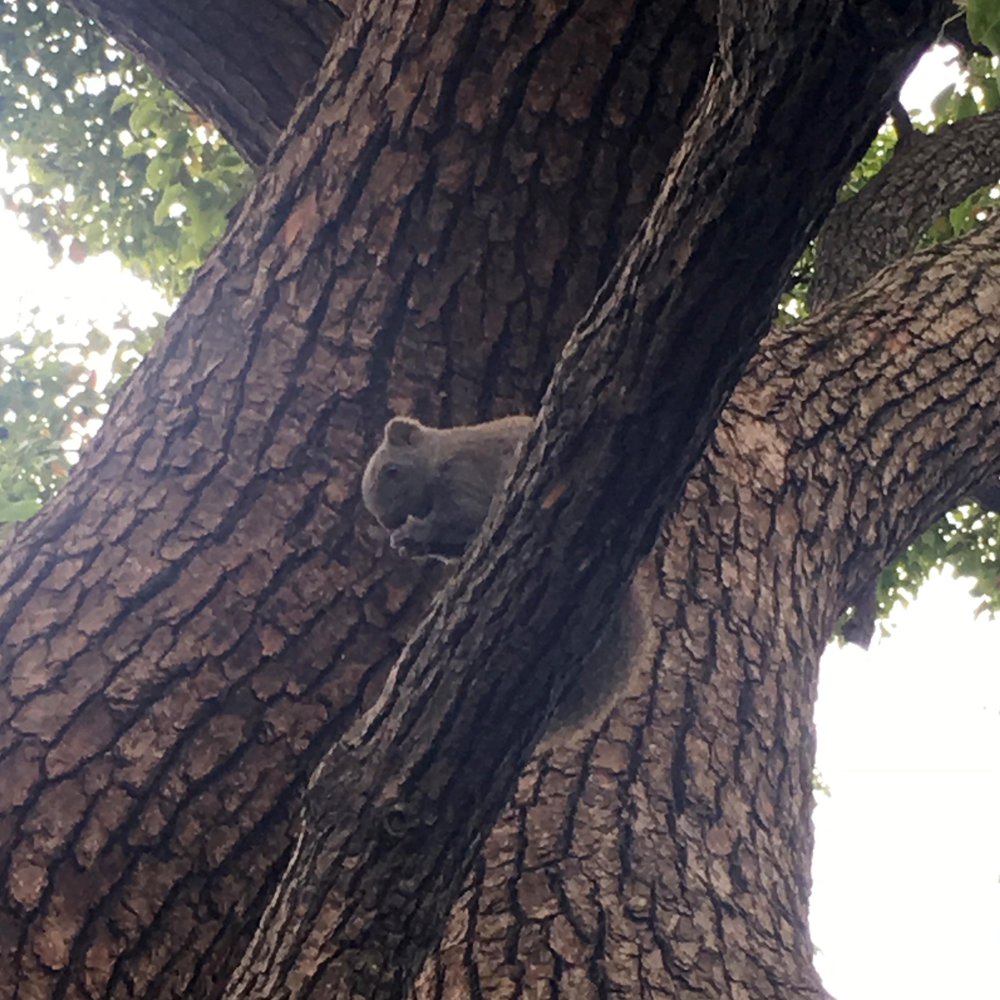
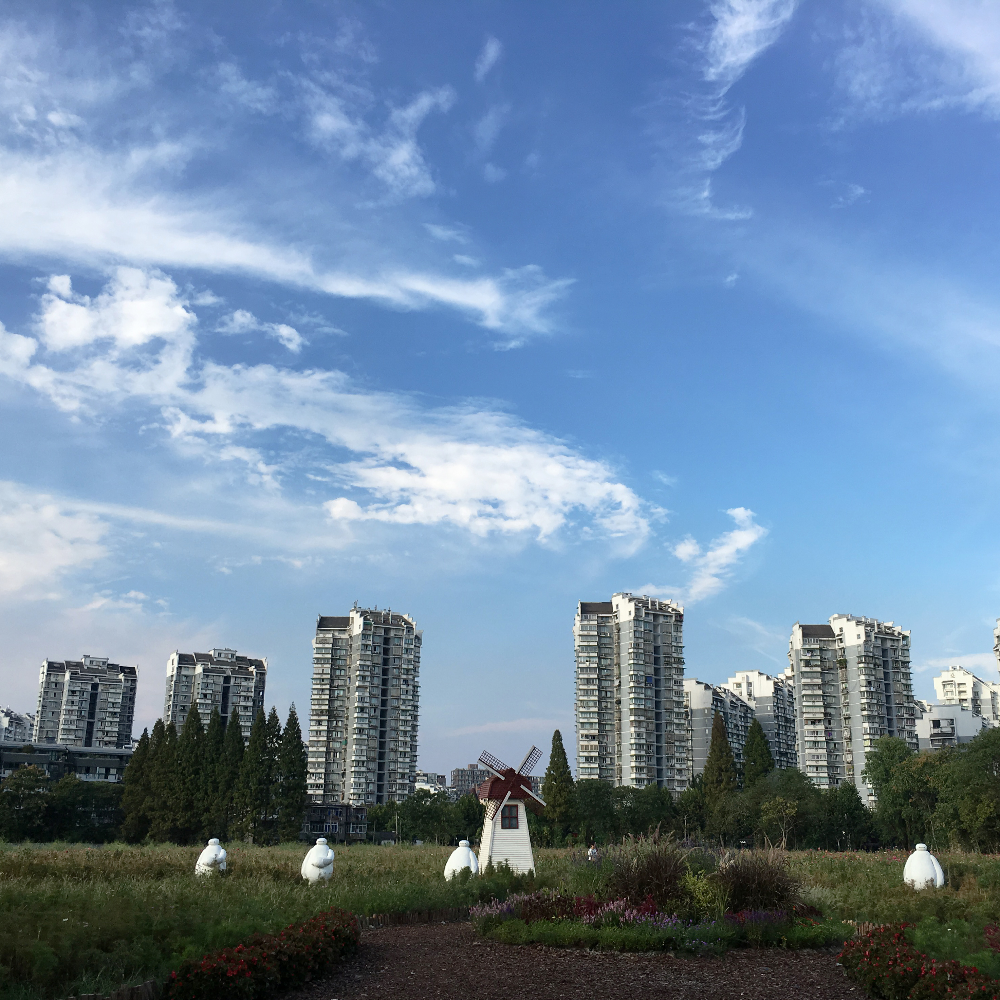

## 欢迎访问我的GitHub Pages

#### 简介

一只iOS开发汪，骑行爱好者，摄影菜手。爱生活，爱游戏。

#### 导航

<a href='#content'>正文</a>   <a href='#photos'>美不胜收</a>   <a href='#tail'>结束语</a>

#### 联系我

Email：binjiayou66@163.com

QQ: 1286216625

## 正文

### [2017.07.07 iOS开发几个重要的概念总结](iOS/AutoreleasRuntimeRunloopMessage.md)

本文主要对iOS开发当中比较重要的几个基础概念进行总结说明，主要包含有Autorelease、RunLoop、Runtime和消息机制。

### [2017.07.06 iOS组件化](iOS/Modulization.md)

私有化Pod库，实现iOS App组件式开发。通过加入反革命工程师大神的Target-Action组件进行调用间解耦。

### [2017.06.10 Swift 4 官方文档命令行工程](https://github.com/binjiayou66/Swift4CommandLine) 

该工程章节、内容基本上都是官方原版，主要是把文章提炼成了知识点。注释大部分为英文，都很容易理解，难点处有自己渣渣英文水平翻译的中文注释。坚持读下来官方文档会很有收获。

## 美不胜收

<table width="100%" style="text-align: center">

<tr style="margin: 0 auto">

<td style="width: 33.3%;"></td>
<td style="width: 33.3%;"></td>
<td style="width: 33.3%;"></td>

</tr>
<tr style="margin: 0 auto">

<td style="width: 33.3%;"></td>

<td style="width: 33.3%;"></td>
<td style="width: 33.3%;"></td>

</tr>

<tr>

<td style="width: 33.3%;"></td>
<td style="width: 33.3%;"></td>

<td style="width: 33.3%;"></td>

</tr>

</table>

## 结束语

安得广厦千万间。

 

文中内容版权归本人所有，若有引用，请联系我。

<a href="#top">↑↑↑</a>
