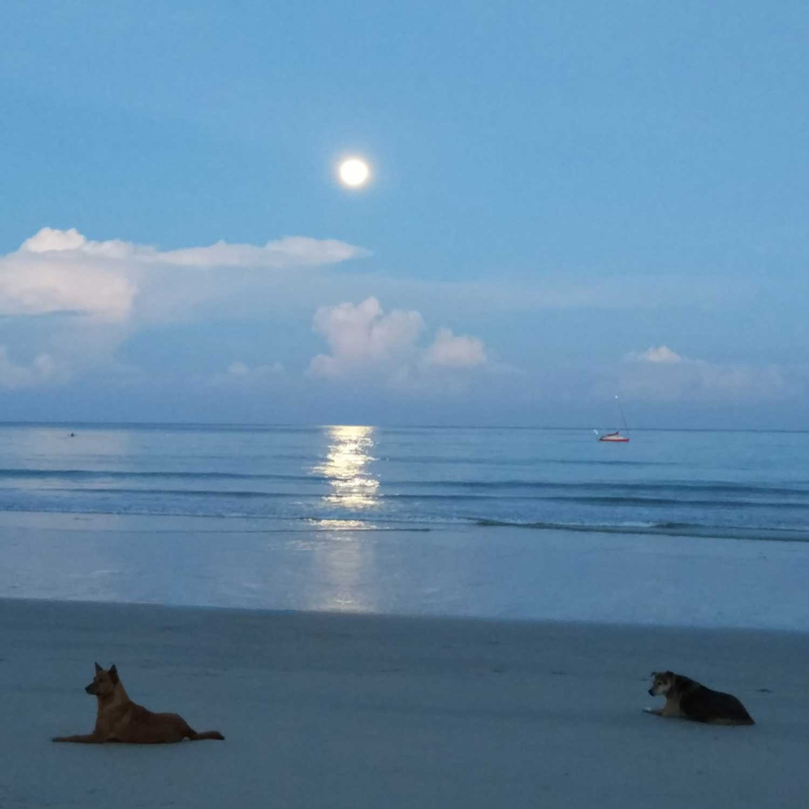
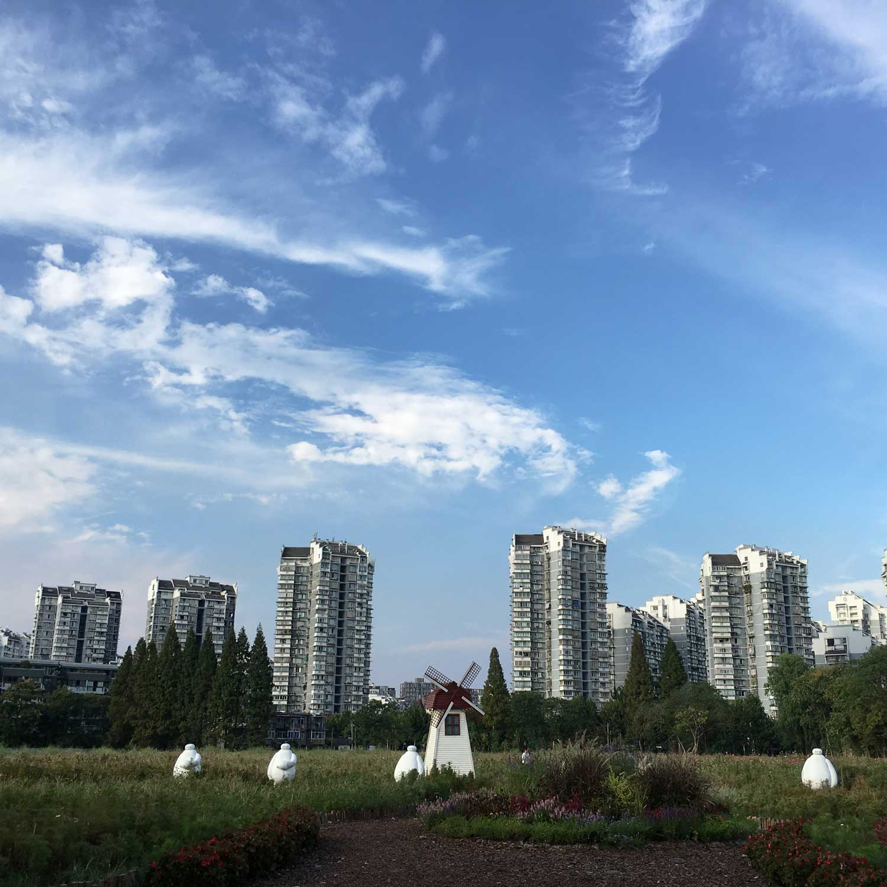

## 欢迎访问我的GitHub Pages

#### 简介

一只iOS开发汪，骑行爱好者，摄影菜手。爱生活，爱游戏。

#### 联系我

Email：binjiayou66@163.com

QQ: 1286216625

## 正文

### [2017.07.06-02 iOS开发几个重要的概念总结](iOS/AutoreleasRuntimeRunloopMessage.md)

本文主要对iOS开发当中比较重要的几个基础概念进行总结说明，主要包含有Autorelease、RunLoop、Runtime和消息机制。

### [2017.07.06-01 iOS组件化](iOS/Modulization.md)

私有化Pod库，实现iOS App组件式开发。通过加入反革命工程师大神的Target-Action组件进行调用间解耦。

<table width="100%" style="text-align: center">

<tr style="margin: 0 auto">

<td style="width: 20%; margin: 0 20px"></td>
<td style="width: 20%; margin: 0 20px"></td>
<td style="width: 20%; margin: 0 20px"></td>
<td style="width: 20%; margin: 0 20px"></td>

</tr>
<tr style="margin: 0 auto">

<td style="width: 20%; margin: 0 20px"></td>
<td style="width: 20%; margin: 0 20px"></td>
<td style="width: 20%; margin: 0 20px"></td>
<td style="width: 20%; margin: 0 20px"></td>

</tr>

</table>

## 结束语

安得广厦千万间。

