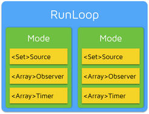

## 一、自动释放池

### 1. 自动释放池本质上做了什么

（1）@autorelease

官方格式

```objective-c
@autorelease { 
  // code 
}  
```

等价于

```objective-c
{ 
	void * autoreleasepoolobj = objc_autoreleasePoolPush();  
	
	// code  

	objc_autoreleasePoolPop(autoreleasepoolobj);

}
```

（2）两个函数

```c
void * objc_autoreleasePoolPush(void) {			
	return AutoreleasePoolPage::Push();
}

void objc_autoreleasePoolPop(void * ctxt) {			
	AutoreleasePoolPage::Pop(ctxt);
}
```


### 2. Autorelease相关关键类，AutoreleasePoolPage

（1）AutoreleasePoolPage是一个C++类

```c++
class AutoreleasePoolPage {			
	magic_t const magic;
	id * next;
	pthread_t const thread;
	AutoreleasePoolPage * const parent;
	AutoreleasePoolPage * child;
	uint32_t const depth;
	uint32_t hiwat;
}
```

（2）每一个AutoreleasePoolPage对象大小为4096字节

（3）每一个AutoreleasePoolPage对象为一个双向链表节点

（4）一个AutoreleasePool由一个或者多个AutoreleasePoolPage对象进行管理自动释放的对象


### 3. AutoreleasePoolPage::Push()做了什么

（1）如果存在hotPage（当前活跃AutoreleasePoolPage对象），并且hotPage对象没有存储满，则将一个哨兵对象（本质为nil）压入hotPage栈顶

（2）如果存在hotPage，但是hotPage已满，则创建新的AutoreleasePoolPage对象，设置为新的hotPage，双向链表进行相关关联后，将一个哨兵对象压入当前hotPage栈顶

（3）如果不存在hotPage，则创建新的AutoreleasePoolPage对象，设置为hotPage，将一个哨兵对象压入当前hotPage栈顶。初始的AutoreleasePoolPage对象的parent节点为空，hotPage的child节点为空。


### 4. 对象发送autorelease消息

对象发送autorelease消息后，当前自动释放池所对应的AutoreleasePoolPage hotPage对象将该对象进行压栈操作（page->add(id obj)）

```c
id * add(id obj) {
	
	id * ret = next;
	*next = obj;
	next++;
	
  	return ret;
}
```


### 5. AutoreleasePoolPage::Pop()做了什么

（1）将晚于该自动释放池的哨兵对象压入栈的所以对象进行出栈操作、release操作


（2）如果存在多余AutoreleasePoolPage，kill掉


## 二、Runloop

### 参考链接[http://www.cocoachina.com/ios/20150601/11970.html](http://www.cocoachina.com/ios/20150601/11970.html)

RunLoop 是 iOS 和 OS X 开发中非常基础的一个概念，这篇文章将从 CFRunLoop 的源码入手，介绍 RunLoop 的概念以及底层实现原理。之后会介绍一下在 iOS 中，苹果是如何利用 RunLoop 实现自动释放池、延迟回调、触摸事件、屏幕刷新等功能的。

内容包括：RunLoop 的概念，RunLoop 与线程的关系，RunLoop 对外的接口，RunLoop 的 Mode，RunLoop 的内部逻辑，RunLoop 的底层实现，苹果用 RunLoop 实现的功能（AutoreleasePool、事件响应、手势识别、界面更新、定时器、PerformSelecter、关于GCD、关于网络请求），RunLoop 的实际应用举例，AFNetworking，AsyncDisplayKit


### 1. RunLoop概念

RunLoop 实际上就是一个对象，这个对象管理了其需要处理的事件和消息，并提供了一个入口函数来执行Event Loop（下述函数）的逻辑。线程执行了这个函数后，就会一直处于这个函数内部 "接受消息->等待->处理" 的循环中，直到这个循环结束（比如传入 quit 的消息），函数返回。

```javascript
function loop() {	
	initialize();
	do {		
		var message = get_next_message();
		process_message(message);
	} while(message != quit);
}
```

OSX/iOS系统中，提供了两个这样的类，NSRunLoop 和 CFRunLoopRef：

CFRunLoopRef 是在 CoreFoundation 框架内的，它提供了纯 C 函数的 API，所有这些 API 都是线程安全的。

NSRunLoop 是基于 CFRunLoopRef 的封装，提供了面向对象的 API，但是这些 API 不是线程安全的。

关键点：

​	a. 如何管理事件/消息。

​	b. 如何让线程在没有处理消息时休眠以避免资源占用、在有消息到来时立刻被唤醒。


### 2. RunLoop对外接口

（1）CFRunLoopRef

（2）CFRunLoopModeRef（CFRunLoopModeRef 类并没有对外暴露，只是通过 CFRunLoopRef 的接口进行了封装。）

（3）CFRunLoopSourceRef

（4）CFRunLoopTimerRef

（5）CFRunLoopObserverRef



一个 RunLoop 包含若干个 Mode，每个 Mode 又包含若干个 Source/Timer/Observer。每次调用 RunLoop 的主函数时，只能指定其中一个 Mode，这个Mode被称作 CurrentMode。如果需要切换 Mode，只能退出 Loop，再重新指定一个 Mode 进入。这样做主要是为了分隔开不同组的 Source/Timer/Observer，让其互不影响。


### 3. 内部逻辑


## 三、Runtime

### 参考链接http://tech.glowing.com/cn/method-swizzling-aop/

### 1. Method Swizzling

#### 【示例】通过Method Swizzling实现Log日志

（1）首先定义一个类别，添加将要 Swizzled 的方法：

```objective-c
@implementation UIViewController (Logging)

- (void)swizzled_viewDidAppear:(BOOL)animated
{

	// call original implementation
	[self swizzled_viewDidAppear:animated];

  	// Logging
	[Logging logWithEventName:NSStringFromClass([self class])];
}
```

（2）接下来实现 swizzle 的方法 ：

```objective-c
@implementation UIViewController (Logging)

void swizzleMethod(Class class, SEL originalSelector, SEL swizzledSelector)  
{

	// the method might not exist in the class, but in its superclass
	Method originalMethod = class_getInstanceMethod(class, originalSelector);
	Method swizzledMethod = class_getInstanceMethod(class, swizzledSelector);

	// class_addMethod will fail if original method already exists
	BOOL didAddMethod = class_addMethod(class, originalSelector, method_getImplementation(swizzledMethod), method_getTypeEncoding(swizzledMethod));

	// the method doesn’t exist and we just added one
	if (didAddMethod) {
		class_replaceMethod(class, swizzledSelector, method_getImplementation(originalMethod), method_getTypeEncoding(originalMethod));
	}else {
		method_exchangeImplementations(originalMethod, swizzledMethod);
	}
}
```

（3）最后，我们只需要确保在程序启动的时候调用 swizzleMethod 方法。比如，我们可以在类别里添加 +load: 方法，然后在 +load: 里把 viewDidAppear 给替换掉：

```objective-c
@implementation UIViewController (Logging)

+ (void)load
{
  	swizzleMethod([self class], @selector(viewDidAppear:), @selector(swizzled_viewDidAppear:));
}
```

【注】一般情况下，类别里的方法会重写掉主类里相同命名的方法。如果有两个类别实现了相同命名的方法，只有一个方法会被调用。但 +load: 是个特例，当一个类被读到内存的时候， runtime 会给这个类及它的每一个类别都发送一个 +load: 消息。

（4）其实，这里还可以更简化点：直接用新的 IMP 取代原 IMP ，而不是替换。只需要有全局的函数指针指向原 IMP 就可以。

```objective-c
void (gOriginalViewDidAppear)(id, SEL, BOOL);

void newViewDidAppear(UIViewController *self, SEL _cmd, BOOL animated)  
{
	// call original implementation
	gOriginalViewDidAppear(self, _cmd, animated);

	// Logging
	[Logging logWithEventName:NSStringFromClass([self class])];
}

+ (void)load
{
	Method originalMethod = class_getInstanceMethod(self, @selector(viewDidAppear:));
	gOriginalViewDidAppear = (void *)method_getImplementation(originalMethod);
	if(!class_addMethod(self, @selector(viewDidAppear:), (IMP) newViewDidAppear, method_getTypeEncoding(originalMethod))) {
		method_setImplementation(originalMethod, (IMP) newViewDidAppear);
	}
}
```


## 四、消息机制

### 参考链接[http://draveness.me/message.html](http://draveness.me/message.html)

### 1. Objective-C 中给一个对象发送消息会经过以下几个步骤：

（1）在对象类的 dispatch table 中尝试找到该消息。如果找到了，跳到相应的函数IMP去执行实现代码；

（2）如果没有找到，Runtime 会发送 +resolveInstanceMethod: 或者 +resolveClassMethod: 尝试去 resolve 这个消息；

（3）如果 resolve 方法返回 NO，Runtime 就发送 -forwardingTargetForSelector: 允许你把这个消息转发给另一个对象；

（4）如果没有新的目标对象返回， Runtime 就会发送 -methodSignatureForSelector: 和 -forwardInvocation: 消息。你可以发送 -invokeWithTarget: 消息来手动转发消息或者发送 -doesNotRecognizeSelector: 抛出异常。

利用 Objective-C 的 runtime 特性，我们可以自己来对语言进行扩展，解决项目开发中的一些设计和技术问题。


## 五、算法