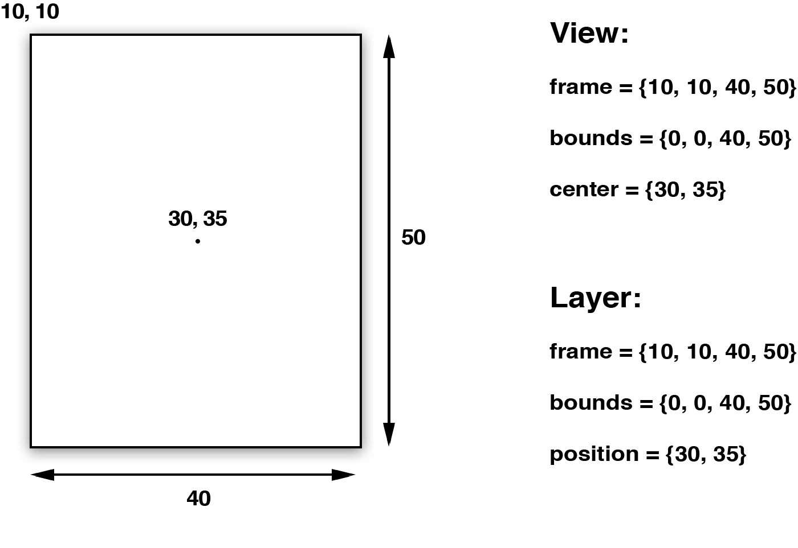
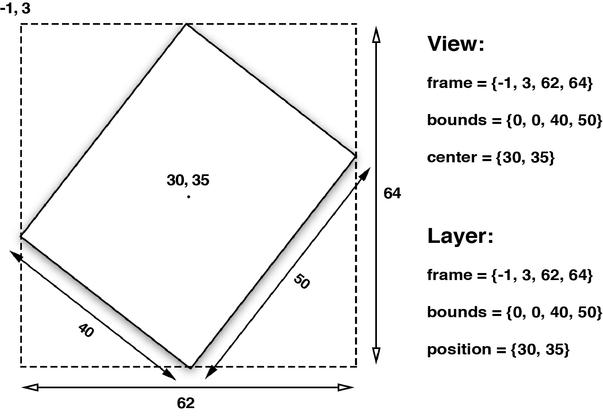

# 总结

基础铺设：Layer，专用Layer，坐标系系统

能力：寄宿图，代理，视觉处理，变换，动画

性能：GPU硬件加速（Core Graphics往往是软件绘图，基于CPU；Core Animation工作较大部分为GPU），图层缓存


# 1. 图层的树状结构

## 参考链接https://zsisme.gitbooks.io/ios-/content/index.html

Core Animation其实是一个令人误解的命名。你可能认为它只是用来做动画的，但实际上它是从一个叫做*Layer Kit*这么一个不怎么和动画有关的名字演变而来，所以做动画这只是Core Animation特性的冰山一角。

Core Animation是一个*复合引擎*，它的职责就是尽可能快地组合屏幕上不同的可视内容，这个内容是被分解成独立的*图层*，存储在一个叫做*图层树*的体系之中。于是这个树形成了**UIKit**以及在iOS应用程序当中你所能在屏幕上看见的一切的基础。

在我们讨论动画之前，我们将从图层树开始，涉及一下Core Animation的*静态*组合以及布局特性。

我们已经证实了图层不能像视图那样处理触摸事件，那么他能做哪些视图不能做的呢？这里有一些`UIView`没有暴露出来的CALayer的功能：

- 阴影，圆角，带颜色的边框
- 3D变换
- 非矩形范围
- 透明遮罩
- 多级非线性动画

如果希望自动排版，布局和事件处理，选用视图；如果希望通用于OS X和iOS、提高渲染能力，选用图层。


# 2. 寄宿图

## Contents

CALayer 有一个属性叫做`contents`，这个属性的类型被定义为id，意味着它可以是任何类型的对象。在这种情况下，你可以给`contents`属性赋任何值，你的app仍然能够编译通过。但是，在实践中，如果你给`contents`赋的不是CGImage，那么你得到的图层将是空白的。

寄宿图相关属性：`contents` `contentGravity` `contentsScale` `maskToBounds` `contentsRect` `contentsCenter`

通过contentsRect属性可以实现通过一张大图截取显示小图，而不需要将大图全部切分成独立的小图片： 

```objective-c
[self addSpriteImage:image withContentRect:CGRectMake(0, 0, 0.5, 0.5) toLayer:self.iglooView.layer];
```


## drawRect:

给`contents`赋CGImage的值不是唯一的设置寄宿图的方法。我们也可以直接用Core Graphics直接绘制寄宿图。能够通过继承UIView并实现`-drawRect:`方法来自定义绘制。

 `-drawRect:` 方法没有默认的实现，因为对UIView来说，寄宿图并不是必须的，它不在意那到底是单调的颜色还是有一个图片的实例。如果UIView检测到`-drawRect:` 方法被调用了，它就会为视图分配一个寄宿图，这个寄宿图的像素尺寸等于视图大小乘以 `contentsScale`的值。

如果你不需要寄宿图，那就不要创建这个方法了，这会造成CPU资源和内存的浪费，这也是为什么苹果建议：如果没有自定义绘制的任务就不要在子类中写一个空的-drawRect:方法。

当视图在屏幕上出现的时候 `-drawRect:`方法就会被自动调用。`-drawRect:`方法里面的代码利用Core Graphics去绘制一个寄宿图，然后内容就会被缓存起来直到它需要被更新（通常是因为开发者调用了`-setNeedsDisplay`方法，尽管影响到表现效果的属性值被更改时，一些视图类型会被自动重绘，如`bounds`属性）。虽然`-drawRect:`方法是一个UIView方法，事实上都是底层的CALayer安排了重绘工作和保存了因此产生的图片。


Delegate

CALayer有一个可选的`delegate`属性，实现了`CALayerDelegate`协议，当CALayer需要一个内容特定的信息时，就会从协议中请求。CALayerDelegate是一个非正式协议，其实就是说没有CALayerDelegate @protocol可以让你在类里面引用啦。你只需要调用你想调用的方法，CALayer会帮你做剩下的。（`delegate`属性被声明为id类型，所有的代理方法都是可选的）。

​    当需要被重绘时，CALayer会请求它的代理给他一个寄宿图来显示。它通过调用下面这个方法做到的:

```
(void)displayLayer:(CALayerCALayer *)layer;

```

​    趁着这个机会，如果代理想直接设置`contents`属性的话，它就可以这么做，不然没有别的方法可以调用了。如果代理不实现`-displayLayer:`方法，CALayer就会转而尝试调用下面这个方法：

```
- (void)drawLayer:(CALayer *)layer inContext:(CGContextRef)ctx;
```

举个例子：

```objective-c
@implementation ViewController
- (void)viewDidLoad
{
  [super viewDidLoad];
  
  //create sublayer
  CALayer *blueLayer = [CALayer layer];
  blueLayer.frame = CGRectMake(50.0f, 50.0f, 100.0f, 100.0f);
  blueLayer.backgroundColor = [UIColor blueColor].CGColor;

  //set controller as layer delegate
  blueLayer.delegate = self;

  //ensure that layer backing image uses correct scale
  blueLayer.contentsScale = [UIScreen mainScreen].scale; //add layer to our view
  [self.layerView.layer addSublayer:blueLayer];

  //force layer to redraw
  [blueLayer display];
}

- (void)drawLayer:(CALayer *)layer inContext:(CGContextRef)ctx
{
  //draw a thick red circle
  CGContextSetLineWidth(ctx, 10.0f);
  CGContextSetStrokeColorWithColor(ctx, [UIColor redColor].CGColor);
  CGContextStrokeEllipseInRect(ctx, layer.bounds);
}
@end
```


# 3. 图层几何学

## 布局

`UIView`有三个比较重要的布局属性：`frame`，`bounds`和`center`，`CALayer`对应地叫做`frame`，`bounds`和`position`。为了能清楚区分，图层用了“position”，视图用了“center”，但是他们都代表同样的值。

 `frame`代表了图层的外部坐标（也就是在父图层上占据的空间），`bounds`是内部坐标（{0, 0}通常是图层的左上角），`center`和`position`都代表了相对于父图层`anchorPoint`所在的位置。`anchorPoint`的属性将会在后续介绍到，现在把它想成图层的中心点就好了。图3.1显示了这些属性是如何相互依赖的。

视图的`frame`，`bounds`和`center`属性仅仅是*存取方法*，当操纵视图的`frame`，实际上是在改变位于视图下方`CALayer`的`frame`，不能够独立于图层之外改变视图的`frame`。

对于视图或者图层来说，`frame`并不是一个非常清晰的属性，它其实是一个虚拟属性，是根据`bounds`，`position`和`transform`计算而来，所以当其中任何一个值发生改变，frame都会变化。相反，改变frame的值同样会影响到他们当中的值

记住当对图层做变换的时候，比如旋转或者缩放，`frame`实际上代表了覆盖在图层旋转之后的整个轴对齐的矩形区域，也就是说`frame`的宽高可能和`bounds`的宽高不再一致了






## 锚点


## 坐标系

和视图一样，图层在图层树当中也是相对于父图层按层级关系放置，一个图层的`position`依赖于它父图层的`bounds`，如果父图层发生了移动，它的所有子图层也会跟着移动。

这样对于放置图层会更加方便，因为你可以通过移动根图层来将它的子图层作为一个整体来移动，但是有时候你需要知道一个图层的*绝对*位置，或者是相对于另一个图层的位置，而不是它当前父图层的位置。

`CALayer`给不同坐标系之间的图层转换提供了一些工具类方法：

```
- (CGPoint)convertPoint:(CGPoint)point fromLayer:(CALayer *)layer;
- (CGPoint)convertPoint:(CGPoint)point toLayer:(CALayer *)layer;
- (CGRect)convertRect:(CGRect)rect fromLayer:(CALayer *)layer;
- (CGRect)convertRect:(CGRect)rect toLayer:(CALayer *)layer;

```

这些方法可以把定义在一个图层坐标系下的点或者矩形转换成另一个图层坐标系下的点或者矩形.


zPosition


## Hit Testing

`CALayer`并不关心任何响应链事件，所以不能直接处理触摸事件或者手势。但是它有一系列的方法帮你处理事件：`-containsPoint:`和`-hitTest:`。


## 自动布局

使用`CALayerDelegate`如下函数：

```
- (void)layoutSublayersOfLayer:(CALayer *)layer;

```

当图层的`bounds`发生改变，或者图层的`-setNeedsLayout`方法被调用的时候，这个函数将会被执行。这使得你可以手动地重新摆放或者重新调整子图层的大小，但是不能像`UIView`的`autoresizingMask`和`constraints`属性做到自适应屏幕旋转。


# 4. 视觉效果

## 圆角

conrnerRadius，masksToBounds

## 图层边框

borderWidth，borderColor

## 阴影

shadowOpacity，shadowPath（CGPath、UIBezierPath）

## 图层蒙板

mask

## 拉伸过滤

minificationFilter，magnificationFilter

```
view.layer.magnificationFilter = kCAFilterNearest;
```

## 组透明

opacity

可以设置CALayer的一个叫做`shouldRasterize`属性（见清单4.7）来实现组透明的效果，如果它被设置为YES，在应用透明度之前，图层及其子图层都会被整合成一个整体的图片。


# 5. 变换

## 仿射变换

`UIView`的`transform`属性是一个`CGAffineTransform`类型，用于在二维空间做旋转，缩放和平移。`CGAffineTransform`是一个可以和二维空间向量（例如`CGPoint`）做乘法的3X2的矩阵（见图5.1）。

## 3D变换

CG的前缀告诉我们，`CGAffineTransform`类型属于Core Graphics框架，Core Graphics实际上是一个严格意义上的2D绘图API，并且`CGAffineTransform`仅仅对2D变换有效。

`transform`属性（`CATransform3D`类型）可以做到让图层在3D空间内移动或者旋转。


# 6. 专用图层

（1）CAShapeLayer

`CAShapeLayer`是一个通过矢量图形而不是bitmap来绘制的图层子类。你指定诸如颜色和线宽等属性，用`CGPath`来定义想要绘制的图形，最后`CAShapeLayer`就自动渲染出来了。

（2）CATextLayer

Core Animation提供了一个`CALayer`的子类`CATextLayer`，它以图层的形式包含了`UILabel`几乎所有的绘制特性，并且额外提供了一些新的特性。

（3）CATransformLayer

`CATransformLayer`不同于普通的`CALayer`，因为它不能显示它自己的内容。只有当存在了一个能作用域子图层的变换它才真正存在。`CATransformLayer`并不平面化它的子图层，所以它能够用于构造一个层级的3D结构。

（4）CAGradientLayer

`CAGradientLayer`是用来生成两种或更多颜色平滑渐变的。用Core Graphics复制一个`CAGradientLayer`并将内容绘制到一个普通图层的寄宿图也是有可能的，但是`CAGradientLayer`的真正好处在于绘制使用了硬件加速。

（5）CAReplicatorLayer

`CAReplicatorLayer`的目的是为了高效生成许多相似的图层。它会绘制一个或多个图层的子图层，并在每个复制体上应用不同的变换。看上去演示能够更加解释这些，我们来写个例子吧。

（6）CAScrollLayer

滑动图层

（7）CATiledLayer

`CATiledLayer`为载入大图造成的性能问题提供了一个解决方案：将大图分解成小片然后将他们单独按需载入。

（8）CAEmitterLayer

`CAEmitterLayer`是一个高性能的粒子引擎，被用来创建实时例子动画如：烟雾，火，雨等等这些效果。

（9）CAEAGLLayer

OpenGL相关

（10）AVPlayerLayer

最后一个图层类型是`AVPlayerLayer`。尽管它不是Core Animation框架的一部分（AV前缀看上去像），`AVPlayerLayer`是有别的框架（AVFoundation）提供的，它和Core Animation紧密地结合在一起，提供了一个`CALayer`子类来显示自定义的内容类型。


# 7. 隐式动画

## 事务

a. Core Animation基于一个假设，说屏幕上的任何东西都可以（或者可能）做动画。动画并不需要你在Core Animation中手动打开，相反需要明确地关闭，否则他会一直存在。

b. 当你改变`CALayer`的一个可做动画的属性，它并不能立刻在屏幕上体现出来。相反，它是从先前的值平滑过渡到新的值。这一切都是默认的行为，你不需要做额外的操作。

当你改变一个属性，Core Animation是如何判断动画类型和持续时间的呢？实际上动画执行的时间取决于当前*事务*的设置，动画类型取决于*图层行为*。

事务实际上是Core Animation用来包含一系列属性动画集合的机制，任何用指定事务去改变可以做动画的图层属性都不会立刻发生变化，而是当事务一旦*提交*的时候开始用一个动画过渡到新值。

事务是通过`CATransaction`类来做管理，这个类的设计有些奇怪，不像你从它的命名预期的那样去管理一个简单的事务，而是管理了一叠你不能访问的事务。`CATransaction`没有属性或者实例方法，并且也不能用`+alloc`和`-init`方法创建它。但是可以用`+begin`和`+commit`分别来入栈或者出栈。

任何可以做动画的图层属性都会被添加到栈顶的事务，你可以通过`+setAnimationDuration:`方法设置当前事务的动画时间，或者通过`+animationDuration`方法来获取值（默认0.25秒）。

Core Animation在每个*run loop*周期中自动开始一次新的事务（run loop是iOS负责收集用户输入，处理定时器或者网络事件并且重新绘制屏幕的东西），即使你不显式的用`[CATransaction begin]`开始一次事务，任何在一次run loop循环中属性的改变都会被集中起来，然后做一次0.25秒的动画。

`CATranscation`接口提供的`+setCompletionBlock:`方法允许你在动画结束的时候提供一个完成的动作。


# 8. 显式动画

CABasicAnimation

CAKeyframeAnimation

CAAnimationGroup

CATransition type subType


# 9. 图层时间

self.window.layer.speed = 0; // 暂停动画


# 10. 缓冲


# 11. 基于定时器的动画

NSTimer，CADisplayLink


# 12. 性能调优

a. 开启shouldRasterize后,CALayer会被光栅化为bitmap,layer的阴影等效果也会被保存到bitmap中。实现图层缓存。

b. 一般导致图形性能的问题大部分都出在了offscreen rendering,因此如果我们发现列表滚动不流畅,动画卡顿等问题,就可以想想和找出我们哪部分代码导致了大量的offscreen 渲染。

会造成 offscreen rendering的原因有：

- Any layer with a mask (layer.mask)
- Any layer with layer.masksToBounds being true
- Any layer with layer.allowsGroupOpacity set to YES and layer.opacity is less than 1.0
- Any layer with a drop shadow (layer.shadow*).
- Any layer with layer.shouldRasterize being true
- Any layer with layer.cornerRadius, layer.edgeAntialiasingMask, layer.allowsEdgeAntialiasing


# 13. 高效绘图

在iOS中，软件绘图通常是由Core Graphics框架完成来完成。但是，在一些必要的情况下，相比Core Animation和OpenGL，Core Graphics要慢了不少。

【注】 但是一旦你实现了`CALayerDelegate`协议中的`-drawLayer:inContext:`方法或者`UIView`中的`-drawRect:`方法（其实就是前者的包装方法），图层就创建了一个绘制上下文，这个上下文需要的大小的内存可从这个算式得出：图层宽*图层高*4字节，宽高的单位均为像素。对于一个在Retina iPad上的全屏图层来说，这个内存量就是 2048*1526*4字节，相当于12MB内存，图层每次重绘的时候都需要重新抹掉内存然后重新分配。软件绘图的代价昂贵，除非绝对必要，你应该避免重绘你的视图。提高绘制性能的秘诀就在于尽量避免去绘制。

异步绘图