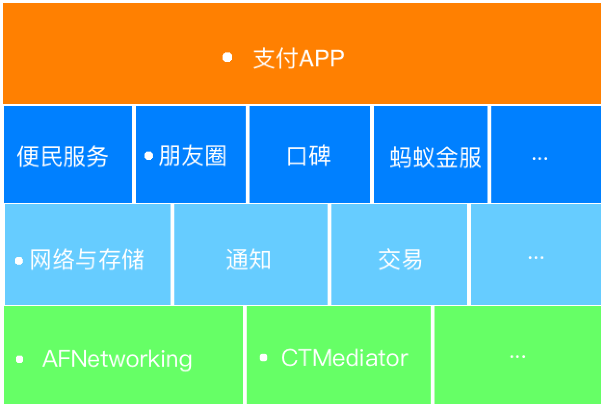

# Part1 iOS工程组件化

<hr>

## 前言

### 1. cocoapods官方地址：[Cocoapods](https://guides.cocoapods.org/)

### 2. 本文模块化结构示意图




## 一、创建私有远程Pod库（以Github为例）

### 1. 创建github repository，用于托管私有Pod库。获取私有库地址（https://github.com/allheroes/iSpecs.git）


2. 将远程私有库关联至本地Pod

在终端中执行：

```shell
pod repo add iSpecs https://github.com/allheroes/iSpecs.git
```


## 二、创建组件

### 1. 创建组件repository - 基础网络库组件（https://github.com/allheroes/iNetworking.git）

### 2. 基础网络组件关联至本地

（1）本地文件采用相对路径，先创建组件化根路径iModulization/

（2）终端切到iModulization/下，克隆网络组件库

```shell
git clone https://github.com/allheroes/iNetworking.git
```

（3）创建网络组件工程，存放在克隆的iModulization/iNetworking/路径内

（4）提交一次git，打tag，提交tag

```shell
git add .
git commit -m "first commit"
git push
# 添加版本
git tag 0.0.1
# 推送tag至远程仓库
git push origin --tags
```


## 三、创建podspec文件

### 1. 创建网络库的spec文件

在网络库路径iModulization/iNetworking/下执行：

```shell
pod spec create iNetworking
```

创建成功后，网络库路径下会新增iNetworking.podspec文件。

### 2. 编写spec文件

（1）自动生成的spec文件会包含官方格式及内容，为保持清晰，此处将注释内容忽略，编辑后spec文件为：

```ruby
Pod::Spec.new do |s|

  s.name                = "iNetworking"
  s.version             = "0.0.1"
  s.summary             = "My modulization demo networking part, iNetworking."

  s.description         = <<-DESC
                            My modulization demo networking part, iNetworking. Good luck to me.
                          DESC

  s.homepage            = "http://www.andy1991.cn"
  s.license             = { :type => "MIT", :file => "LICENSE" }
  s.author              = { "naibin.liu" => "binjiayou66@163.com" }
  s.platform            = :ios, "8.0"
  s.source              = { :git => "https://github.com/allheroes/iNetworking.git", :tag => "#{s.version}" }
  s.source_files        = "iNetworking/iNetworking/**/*.{h,m}"
  s.requires_arc        = true
  
  s.dependency "AFNetworking", "~> 3.1.0" 
  s.dependency "CTMediator"

end
```

【注】source_files内容设置为相对路径，这里最好不要将网络库main、AppDelegate文件作为库文件。

【注】subspec的声明格式本质上是一样的，可以声明子spec，subspec，详见cocoapods官方指导

（2）创建Content文件夹，为演示效果，这里先创建一个类文件在iNetworking中，命名为iNetworking.h

（3）验证spec文件有效性，运行：

```shell
pod lib lint
```

验证成功，终端显示：iNetworking passed validation.

【注】--allow-warnings，可以允许存在警告

### 3. 提交spec文件至私有Pod仓库

```shell
pod repo push iOSSpecs iOSModulizationNetworking.podspec
```


## 四、创建上层组件

### 1. github创建业务模块-好友（https://github.com/allheroes/iFriends.git）

### 2. 业务模块克隆至本地

### 3. 新建业务工程iFriends

### 4. 提交github，打tag提交

### 5. 创建Podfile，pod网络模块

```shell
$ pod install

Analyzing dependencies
Downloading dependencies
Installing AFNetworking (3.1.0)
Installing iNetworking (0.0.1)
Generating Pods project
Integrating client project

[!] Please close any current Xcode sessions and use `iFriends.xcworkspace` for this project from now on.
Sending stats
Pod installation complete! There is 1 dependency from the Podfile and 2 total pods installed.
```


## 五、好友组件创建spec文件，形成组件

 iFriends.podspec文件：

```ruby
Pod::Spec.new do |s|

  s.name                = "iFriends"
  s.version             = "0.0.1"
  s.summary             = "My modulization demo networking part, iFriends."

  s.description         = <<-DESC
                            My modulization demo networking part, iFriends. Good luck to me.
                          DESC

  s.homepage            = "http://www.andy1991.cn"
  s.license             = { :type => "MIT", :file => "LICENSE" }
  s.author              = { "naibin.liu" => "binjiayou66@163.com" }
  s.platform            = :ios, "8.0"
  s.source              = { :git => "https://github.com/allheroes/iFriends.git", :tag => "#{s.version}" }
  s.source_files        = "iFriends/iFriends/**/*.{h,m}"
  s.requires_arc        = true
  
  s.dependency "iNetworking"

end
```


## 六、创建最顶层APP

### 1. 在github中创建顶层应用repo iPay（https://github.com/allheroes/iPay.git）

### 2. 将顶层应用克隆至本地，创建Project

### 3. 创建Podfile，pod业务工程，提交一次git

### 4. 在iPay中，使用组件

<hr>

<br>

# Part2 Target-Action解耦

<hr>

## 【参考内容】反革命工程师[Casa Taloyum](https://casatwy.com/)