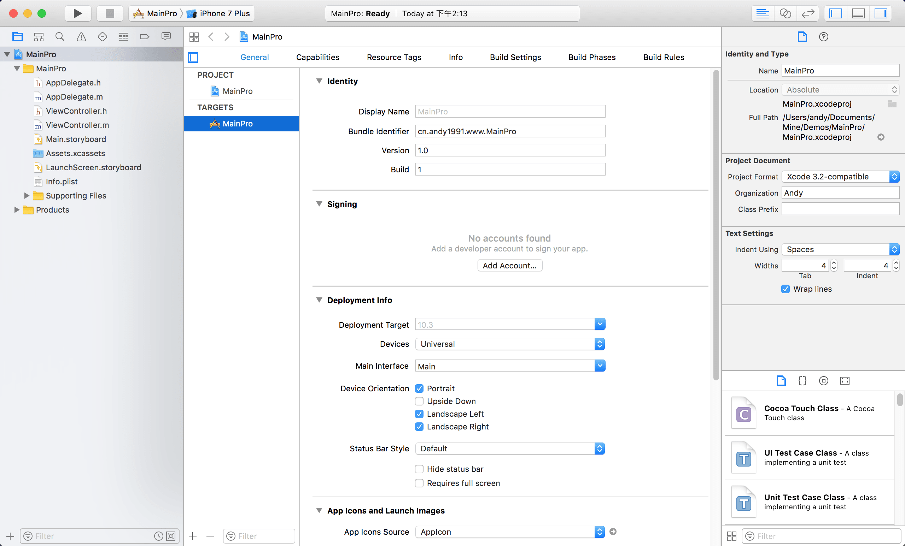
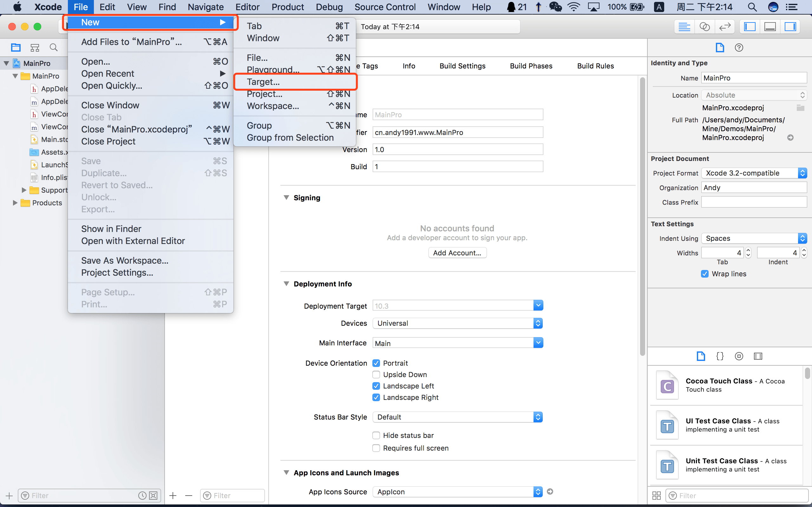
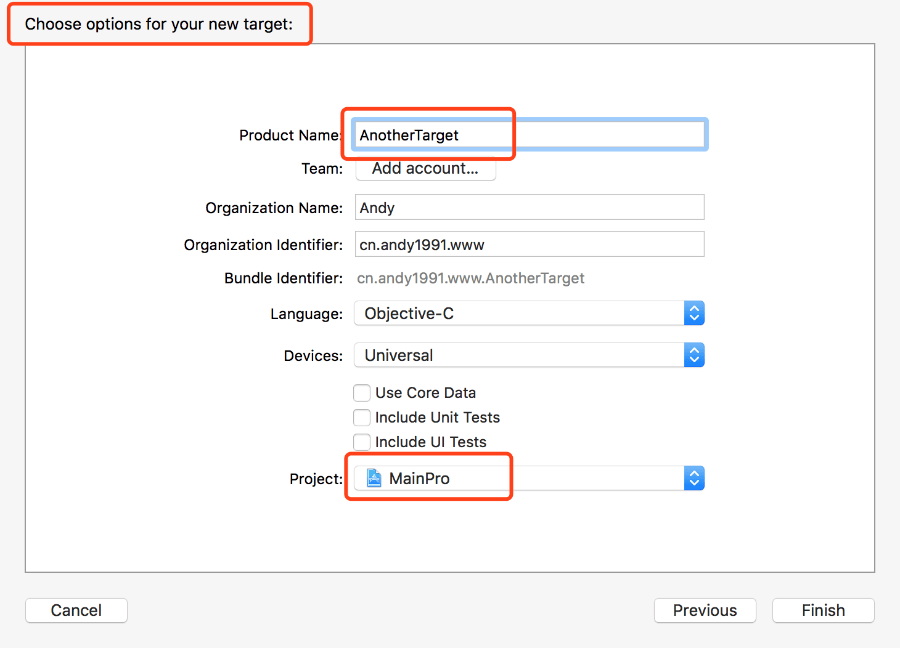
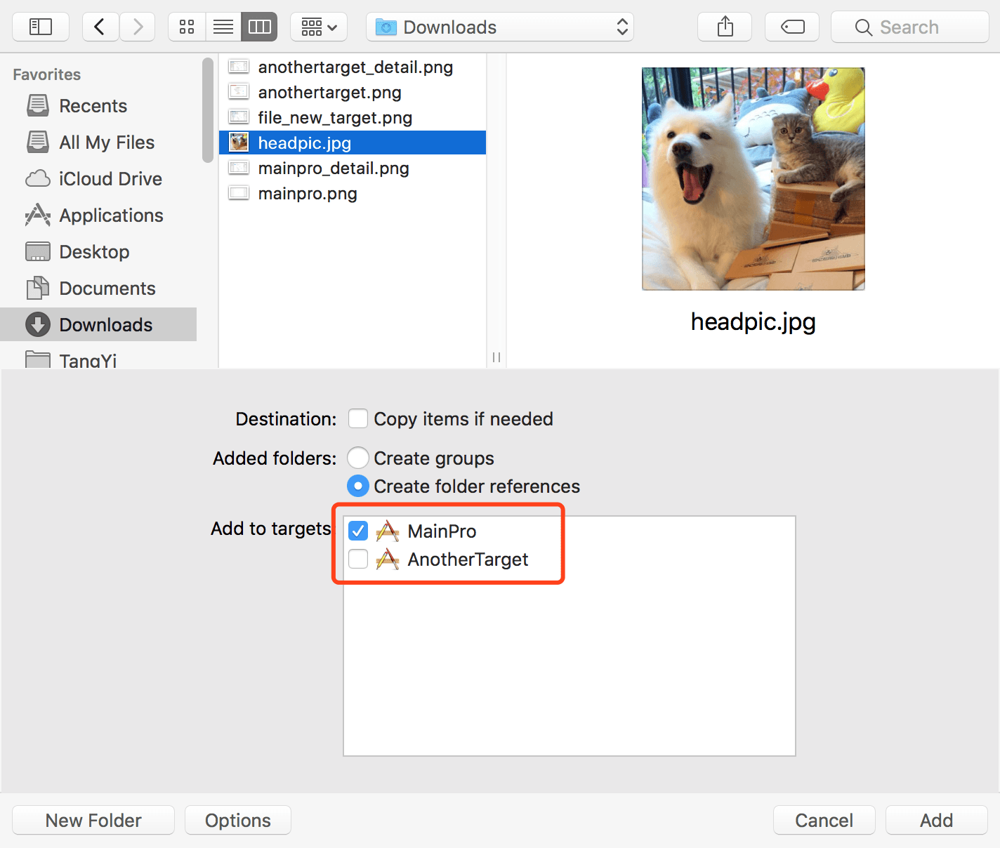
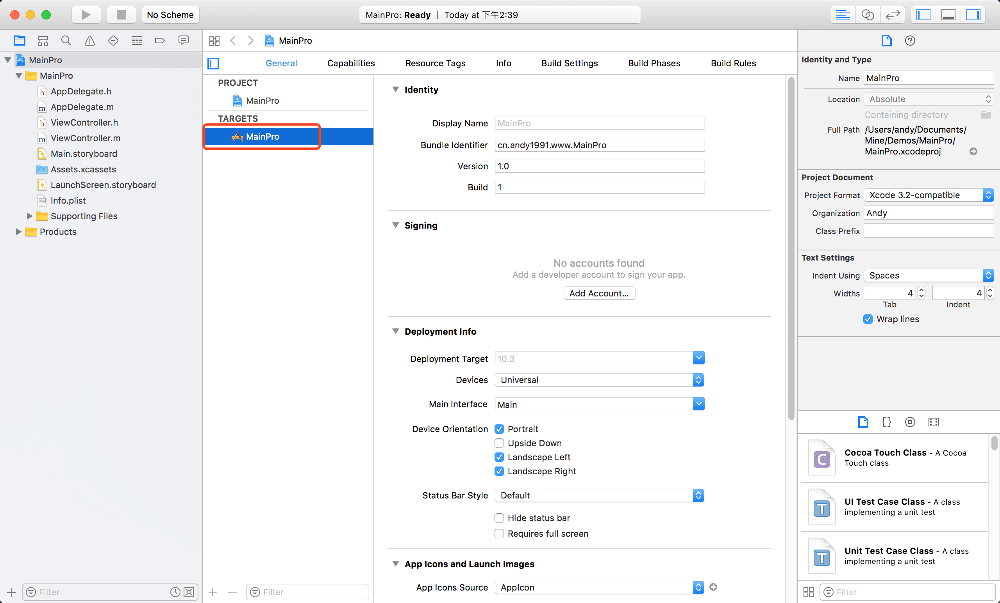
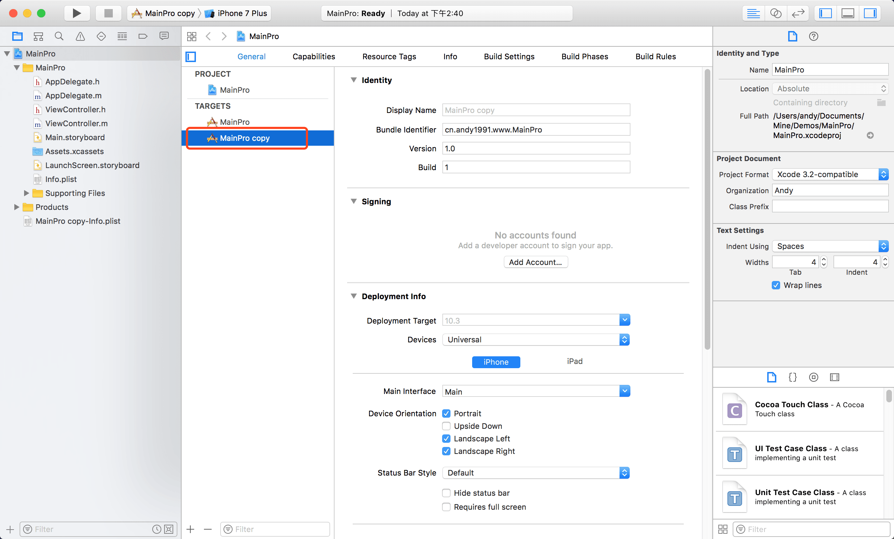
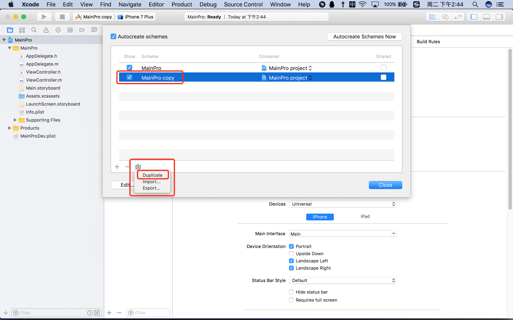
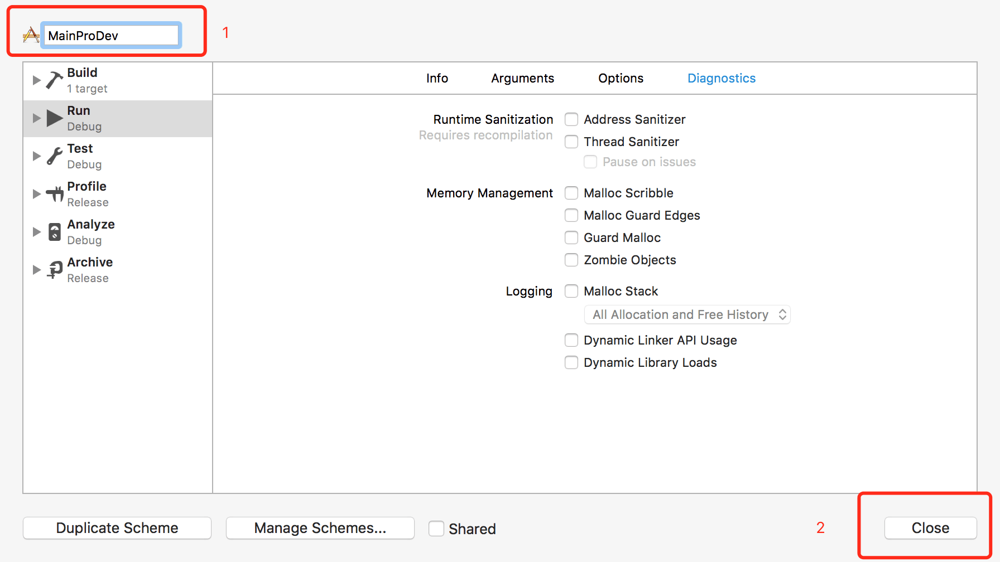
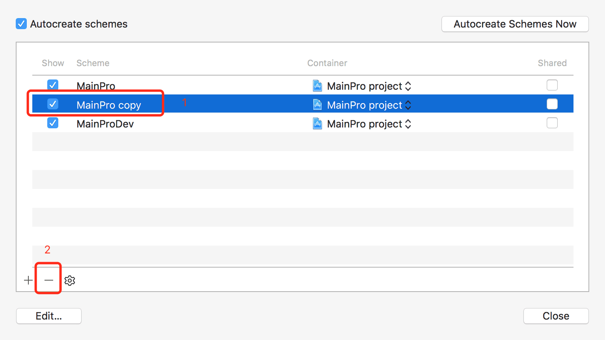

<a id="top" name="top"></a>

# 前言

在Xcode单个Project中会出现多个Target的情况，本文简述两种产生多个Target的方法及它们的作用。

# 一、创建互相独立的Targets

## 1. 创建

（1）新建Single View Project MainPro


创建完成Project之后，我们可以看到以下的初始化界面，在这时，我们只有一个Target（MainPro），与Project名称相同。



（2）File -> New -> Target 建立AnotherTarget



我们创建一个名为AnotherTarget的新Taregt，且将新的Target加入MainPro Project。



创建完成后我们可以看到Targets列表此时已经包含了两个Target（MainPro，AnotherTarget）。


## 2. 作用

（1）这种方法创建的多个Target会产生全套的Target文件，如AppDelegate、ViewController、Info.plist等文件，且可以通过Targets区域选择某一个Target对该Target进行Display Name，Bundle Identifier等属性的设置。

（2）在多个Target的Project中，当我们需要往项目中引入资源文件时，在下方Add to targets选项，可以通过勾选的形式将资源文件加入一个或多个Target当中。



# 二、拷贝Target

## 1. 拷贝

（1）创建MainPro（此处步骤与一中所述相同，此处不再上图）

（2）选中Targets列表下的MainPro Target选项，右击选择Duplicate或者直接快捷键Apple + D




通过Duplicate操作，我们可以得到一个MainPro target的拷贝，默认名称为MainPro copy。并且这里我们还可以发现，在文件列表中，得到了一份MainPro target的info.plist拷贝， 默认名为MainPro copy-Info.plist。



往往我们不会采用拷贝的默认名字，我们可以通过1双击拷贝Target名字进行重命名，通过2双击plist文件修改配置文件名。当我们修改了plist文件名之后，Target就找不到plist文件了，需要通过点击3处，重新选择重命名之后的plist文件，这样才可以。


经过以上3步重命名之后，还有一处默认名称，在下图中Scheme列表中，副本target的Scheme名称依然为默认名称，下面我们将通过复制-重命名-删除备份Scheme的方式，得到我们想要的Scheme名称。


点击Manage Schemes，选中副本Scheme，点击设置按钮，选择Duplicate，对该副本Scheme再进行一次拷贝。



在拷贝界面右上角1处，可以自命名新的Scheme，我们修改为MainProDev，点击Close关闭即可。



最后，我们将MainPro copy Scheme删除，保留一份MainProDev即可。



至此，我们就通过拷贝的方式，得到了一个新的Target。


## 2. 作用

（1）通过拷贝方式得来了Targe与原Targe共享现有所有文件，但是它们各自有自己的Target配置和plist文件配置，这就使得我们可以在开发过程当中，可以配置不同的bundle id，配置不同的证书文件，在同一款测试机器上安装不同环境的应用，为我们的开发测试工作提供了很大的帮助。

（2）在不同Target中，我们可以配置Preprocessor Macros，在代码中通过判断Preprocessor Macros就可以判断当前处于的开发环境。如下图中，我们为MainProDev Target添加了一个Dev的参数。


当我们在ViewController中执行以下代码，并且当前选中MainProDev Target时，只会打印出Many Logs.：

```objective-c
#if Dev
    NSLog(@"Many Logs.");
#else
    NSLog(@"Not in dev.");
#endif
```


# 结束语

时间比较匆忙，多Targets工程的作用部分并没有说的很全面，欢迎补充与勘误。